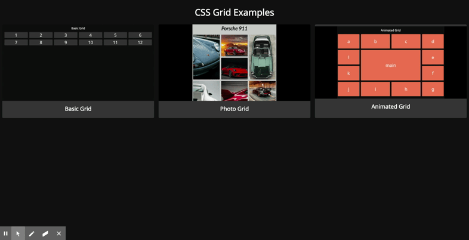

# CSS-Grid
## CSS Grid - 3 Responsive Layouts

## Launch Demo
## https://marcldo.github.io/CSS-Grid/

### In this project I create 3 responsive layouts using CSS Grid
1. Responsive 12-column bootstrap replacement. 
2. Mosaic photo gallery.
3. Staggered animation grid.

